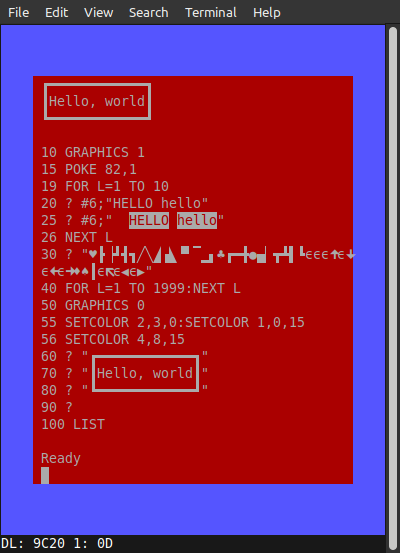

### Atari 800 Emulator in a terminal or console

Uses standard vt100/ANSI to fake a GTIA/ANTIC image.  

Needs a terminal window or console of at least 48x31 characters. Modern
terminal emulators like gnome-terminal, konsole, lxterminal, but also the
Linux console and good 'ol xterm work fine. It needs to handle vt100/ANSI
codes and unicode characters. A proper unicode font for all the control
character glyphs is required.

##### Instructions

* download the atari800 sources from https://github.com/atari800/atari800

* configure it with ./configure --target=libatari800

* make it so

* copy src/libatari800.a to the atariterm directory

* make

* ./atariterm [atari800 command line options]

If you use the default $HOME/.atari800.cfg configuration you might see
some error messages flash by that complain about SDL related stuff. You
can safely ignore them.  

Limitted color support by the fake GTIA and ANTIC implementation. Only two shades per color and a lot of colors map to the same base color. You do get
a different text color than the background though, just like a Sophia upgrade
on real hardware. You get used to yellow on blue pretty quickly.  

Instead of the unreadable unicode character for escape (␛) I have to chosen
to display the lunate epsilon symbol (ϵ).  

Non-text modes are displayed as empty scanlines in groups of eight. Rendering
graphics 3, 4, and 5 should be possible with unicode characters, but I
doubt its usefulness.  

The emulator runs at the approximately normal speed of 20ms per frame.  

##### Keybindings

* F2 Option
* F3 Select
* F4 Start
* F5 Warmstart (+shift is coldstart)
* F6 Help
* F7 Break
* F8 Caps
* F9 Exit emulator
* Alt-, Alt-. and Alt-; map to Control-, Control-. and Control-; respectively.
* Home Clear
* Arrows are cursor keys

##### Screenshots

The code in this repository is Copyright © 2023 by Ivo van Poorten  

See LICENSE for details.  
